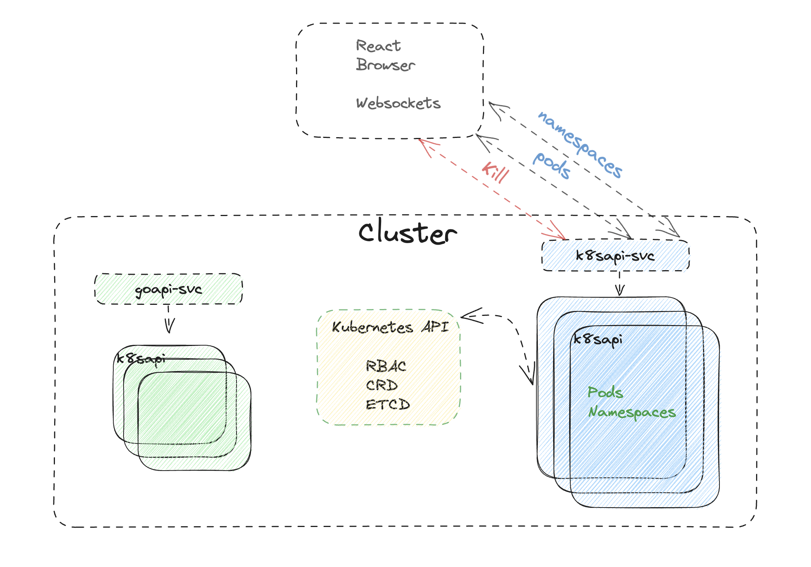
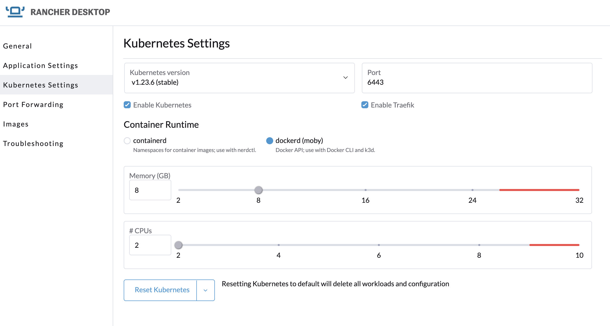

## Description
The following will deascribe how to build and test an API using `Rancher Desktop` then deploy the image into a Kubernetes cluster

Rancher should be setup to run Kubernetes, and dockerd(moby) Container Runtime




### 0-60 in 10 seconds
``` bash
kind create cluster --name dev1-cluster
docker build -t k8sapi:1.4 .
kind load docker-image k8sapi:1.4 --name dev1-cluster
kubectl apply -f k8s/rbac.yaml
kubectl apply -f k8s/svc-deploy.yaml

stern k8sapi
kubectl port-forward svc/k8sapi-svc 8080:8080

curl -s localhost:8080/namespaces
curl -s localhost:8080/pods
curl -s localhost:8080/deletePod/default/k8sapi-64db99b85-jl4cz

ab -n 10 -c 10 http://localhost:8080/pods
hyperfine "curl -v http://127.0.0.1:8080/namespaces" --warmup 10

kind delete cluster --name dev1-cluster
```

### Quick test of the API
```bash
open src/index.html
```
Then open developer mode and read the console log,  manually delete a pod and watch the websocket update


```bash
/namespaces
/pods
/pods/{ns}
/deletePod/{ns}/{pname}

websocket handlers for realtime updates
/ws/pods
/ws/namespaces
```


## Build the image
First build the image and store in our local 

``` bash
docker build -t k8sapi .
```

## Run in Kubernetes
As we're using the K8s API,  and need to authenticate, we can do this using the `inCLuster` config.   
We will also be limited by RBAC, so should created the following items: -
- ServiceAccount
- ClusterRole
- ClusterRoleBinding

``` bash
kubectl apply -f k8s/rbac.yaml
```

Now we can deploy the application, and front it with a LoadBalancer which can be used for port-forwarding later.  The key point here is that the Deployment uses the ServiceAccount created in the previous step, and gets access to the relevant K8s API.

``` bash
kubectl apply -f k8s/svc-deploy.yaml
```


### Left for Rancher Desktop reference
Ignore this
``` bash
kubectl run --image k8sapi k8sapi --image-pull-policy='Never'

```